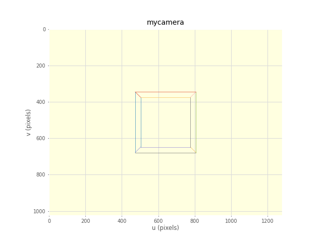
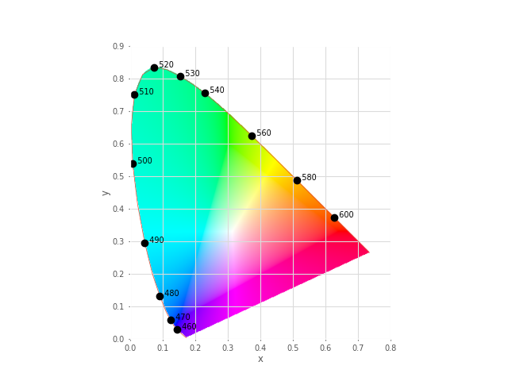
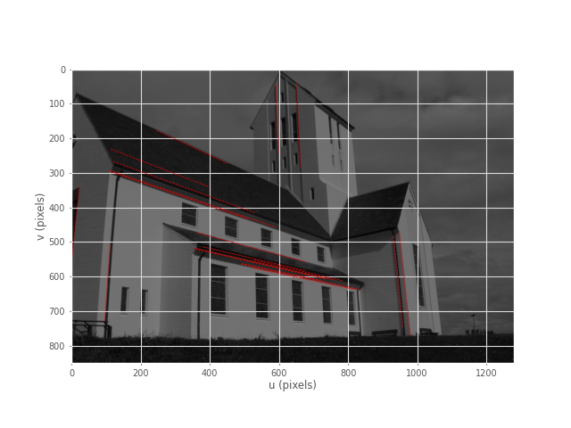
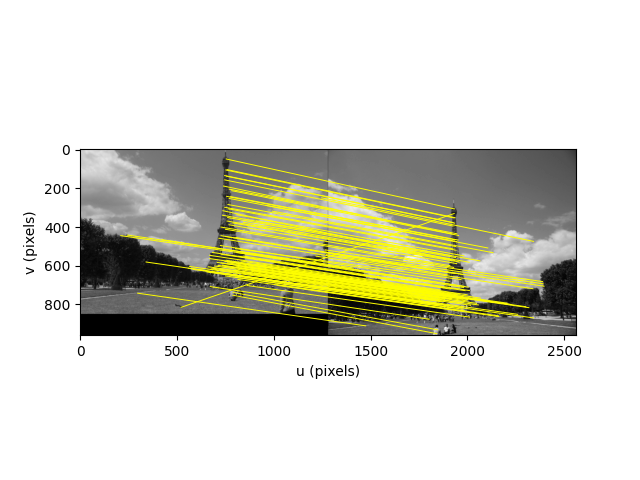
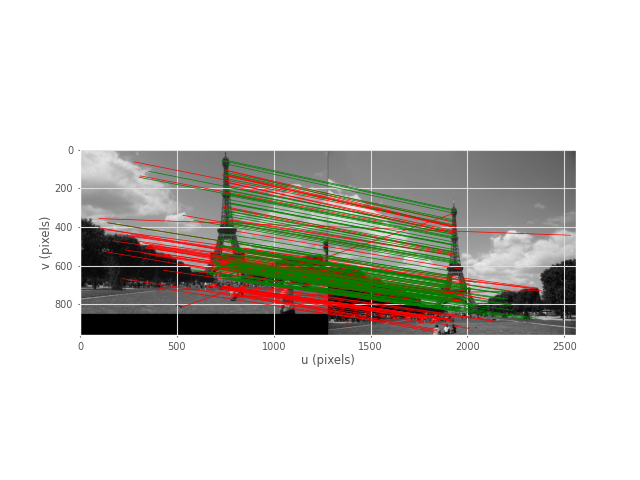

# Machine Vision Toolbox for Python

[](https://github.com/petercorke/robotics-toolbox-python)
[](https://opencv.org)
[](https://open3d.org)
[](https://github.com/petercorke/spatialmath-python)
[](https://qcr.github.io)

[](https://badge.fury.io/py/machinevision-toolbox-python)
[](https://anaconda.org/conda-forge/machinevisiontoolbox-python)

[](https://opensource.org/licenses/MIT)

[](https://github.com/petercorke/machinevisiontoolbox-python/actions?query=workflow%3Abuild)
[](https://codecov.io/gh/petercorke/machinevision-toolbox-python)
[](https://lgtm.com/projects/g/petercorke/machinevision-toolbox-python/context:python)
[](https://pypistats.org/packages/machinevision-toolbox-python)
[](https://GitHub.com/petercorke/machinevision-toolbox-python/stargazers/)


<table style="border:0px">
<tr style="border:0px">
<td style="border:0px">
</td>
<td style="border:0px">

A Python implementation of the <a href="https://github.com/petercorke/machinevision-toolbox-matlab">Machine Vision Toolbox for MATLAB<sup>&reg;</sup></a><ul>
<li><a href="https://github.com/petercorke/machinevision-toolbox-python">GitHub repository </a></li>
<li><a href="https://petercorke.github.io/machinevision-toolbox-python/">Documentation</a></li>
<li><a href="https://github.com/petercorke/machinevision-toolbox-python/wiki">Examples and details</a></li>
<li><a href="installation#">Installation</a></li>
</ul>
</td>
</tr>
</table>


## Synopsis

The Machine Vision Toolbox for Python (MVTB-P) provides many functions that are useful in machine vision and vision-based control.  The main components are:

- An object-oriented wrapper of OpenCV functions that supports operator overloading and handles the gnarly details of OpenCV like conversion to/from float32 and the BGR color order.

An image is usually treated as a rectangular array of scalar values representing intensity or perhaps range, or 3-vector values representing a color image.  The matrix is the natural datatype of [NumPy](https://numpy.org) and thus makes the manipulation of images easily expressible in terms of arithmetic statements in Python.  
Advantages of this Python Toolbox are that:

  * it uses, as much as possibe, [OpenCV](https://opencv.org), which is a portable, efficient, comprehensive and mature collection of functions for image processing and feature extraction;
  * it wraps the OpenCV functions in a consistent way, hiding some of the complexity of OpenCV;
  * it is has similarity to the Machine Vision Toolbox for MATLAB.

# Getting going

## Using pip

Install a snapshot from PyPI

```
% pip install machinevision-toolbox-python
```

## From GitHub

Install the current code base from GitHub and pip install a link to that cloned copy

```
% git clone https://github.com/petercorke/machinevision-toolbox-python.git
% cd machinevision-toolbox-python
% pip install -e .
```

# Examples


### Binary blobs

```python
import machinevisiontoolbox as mvtb
import matplotlib.pyplot as plt
im = mvtb.Image('shark2.png')   # read a binary image of two sharks
fig = im.disp();   # display it with interactive viewing tool
f = im.blobs()  # find all the white blobs
print(f)

	┌───┬────────┬──────────────┬──────────┬───────┬───────┬─────────────┬────────┬────────┐
	│id │ parent │     centroid │     area │ touch │ perim │ circularity │ orient │ aspect │
	├───┼────────┼──────────────┼──────────┼───────┼───────┼─────────────┼────────┼────────┤
	│ 0 │     -1 │ 371.2, 355.2 │ 7.59e+03 │ False │ 557.6 │       0.341 │  82.9° │  0.976 │
	│ 1 │     -1 │ 171.2, 155.2 │ 7.59e+03 │ False │ 557.6 │       0.341 │  82.9° │  0.976 │
	└───┴────────┴──────────────┴──────────┴───────┴───────┴─────────────┴────────┴────────┘

f.plot_box(fig, color='g')  # put a green bounding box on each blob
f.plot_centroid(fig, 'o', color='y')  # put a circle+cross on the centroid of each blob
f.plot_centroid(fig, 'x', color='y')
plt.show(block=True)  # display the result
```


### Binary blob hierarchy

We can load a binary image with nested objects

```python
im = mvtb.Image('multiblobs.png')
im.disp()
```


```python
f  = im.blobs()
print(f)
	┌───┬────────┬───────────────┬──────────┬───────┬────────┬─────────────┬────────┬────────┐
	│id │ parent │      centroid │     area │ touch │  perim │ circularity │ orient │ aspect │
	├───┼────────┼───────────────┼──────────┼───────┼────────┼─────────────┼────────┼────────┤
	│ 0 │      1 │  898.8, 725.3 │ 1.65e+05 │ False │ 2220.0 │       0.467 │  86.7° │  0.754 │
	│ 1 │      2 │ 1025.0, 813.7 │ 1.06e+05 │ False │ 1387.9 │       0.769 │ -88.9° │  0.739 │
	│ 2 │     -1 │  938.1, 855.2 │ 1.72e+04 │ False │  490.7 │       1.001 │  88.7° │  0.862 │
	│ 3 │     -1 │  988.1, 697.2 │ 1.21e+04 │ False │  412.5 │       0.994 │ -87.8° │  0.809 │
	│ 4 │     -1 │  846.0, 511.7 │ 1.75e+04 │ False │  496.9 │       0.992 │ -90.0° │  0.778 │
	│ 5 │      6 │  291.7, 377.8 │  1.7e+05 │ False │ 1712.6 │       0.810 │ -85.3° │  0.767 │
	│ 6 │     -1 │  312.7, 472.1 │ 1.75e+04 │ False │  495.5 │       0.997 │ -89.9° │  0.777 │
	│ 7 │     -1 │  241.9, 245.0 │ 1.75e+04 │ False │  496.9 │       0.992 │ -90.0° │  0.777 │
	│ 8 │      9 │ 1228.0, 254.3 │ 8.14e+04 │ False │ 1215.2 │       0.771 │ -77.2° │  0.713 │
	│ 9 │     -1 │ 1225.2, 220.0 │ 1.75e+04 │ False │  496.9 │       0.992 │ -90.0° │  0.777 │
	└───┴────────┴───────────────┴──────────┴───────┴────────┴─────────────┴────────┴────────┘
```

We can display a label image, where the value of each pixel is the label of the blob that the pixel
belongs to

```python
out = f.labelImage(im)
out.stats()
out.disp(block=True, colormap='jet', cbar=True, vrange=[0,len(f)-1])
```


and request the blob label image which we then display

```matlab
>> [label, m] = ilabel(im);
>> idisp(label, 'colormap', jet, 'bar')
```


### Camera modelling

```python
cam = mvtb.CentralCamera(f=0.015, rho=10e-6, imagesize=[1280, 1024], pp=[640, 512], name='mycamera')
print(cam)
	           Name: mycamera [CentralCamera]
	   focal length: (array([0.015]), array([0.015]))
	     pixel size: 1e-05 x 1e-05
	   principal pt: (640.0, 512.0)
	     image size: 1280.0 x 1024.0
	   focal length: (array([0.015]), array([0.015]))
	           pose: t = 0, 0, 0; rpy/zyx = 0°, 0°, 0°
```

and its intrinsic parameters are

```matlab 
print(cam.K)
	[[1.50e+03 0.00e+00 6.40e+02]
	 [0.00e+00 1.50e+03 5.12e+02]
	 [0.00e+00 0.00e+00 1.00e+00]]
```
We can define an arbitrary point in the world

```python 
P = [0.3, 0.4, 3.0]
```
and then project it into the camera

```python
p = cam.project(P)
print(p)
	[790. 712.]
```
which is the corresponding coordinate in pixels.  If we shift the camera slightly the image plane coordinate will also change

```python 
p = cam.project(P, T=SE3(0.1, 0, 0) )
print(p)
[740. 712.]
```

We can define an edge-based cube model and project it into the camera's image plane

```python 
X, Y, Z = mkcube(0.2, pose=SE3(0, 0, 1), edge=True)
cam.mesh(X, Y, Z)
```


<!---or with a fisheye camera

```matlab
>> cam = FishEyeCamera('name', 'fisheye', ...
'projection', 'equiangular', ...
'pixel', 10e-6, ...
'resolution', [1280 1024]);
>> [X,Y,Z] = mkcube(0.2, 'centre', [0.2, 0, 0.3], 'edge');
>> cam.mesh(X, Y, Z);
```


### Bundle adjustment
--->
### Color space
Plot the CIE chromaticity space

```python
showcolorspace('xy')
```


Load the spectrum of sunlight at the Earth's surface and compute the CIE xy chromaticity coordinates

```python
nm = 1e-9
lam = np.linspace(400, 701, 5) * nm # visible light
sun_at_ground = loadspectrum(lam, 'solar')
xy = lambda2xy(lambda, sun_at_ground)
print(xy)
	[[0.33272798 0.3454013 ]]
print(colorname(xy, 'xy'))
	khaki
```

### Hough transform

```matlab
im = iread('church.png', 'grey', 'double');
edges = icanny(im);
h = Hough(edges, 'suppress', 10);
lines = h.lines();

idisp(im, 'dark');
lines(1:10).plot('g');

lines = lines.seglength(edges);

lines(1)

k = find( lines.length > 80);

lines(k).plot('b--')
```


### SURF features

We load two images and compute a set of SURF features for each

```matlab
>> im1 = iread('eiffel2-1.jpg', 'mono', 'double');
>> im2 = iread('eiffel2-2.jpg', 'mono', 'double');
>> sf1 = isurf(im1);
>> sf2 = isurf(im2);
```
We can match features between images based purely on the similarity of the features, and display the correspondences found

```matlab
>> m = sf1.match(sf2)
m = 
644 corresponding points (listing suppressed)
>> m(1:5)
ans = 
 
(819.56, 358.557) <-> (708.008, 563.342), dist=0.002137
(1028.3, 231.748) <-> (880.14, 461.094), dist=0.004057 
(1027.6, 571.118) <-> (885.147, 742.088), dist=0.004297
(927.724, 509.93) <-> (800.833, 692.564), dist=0.004371
(854.35, 401.633) <-> (737.504, 602.187), dist=0.004417
>> idisp({im1, im2})
>> m.subset(100).plot('w')
```


Clearly there are some bad matches here, but we we can use RANSAC and the epipolar constraint implied by the fundamental matrix to estimate the fundamental matrix and classify correspondences as inliers or outliers

```matlab
>> F = m.ransac(@fmatrix, 1e-4, 'verbose')
617 trials
295 outliers
0.000145171 final residual
F =
    0.0000   -0.0000    0.0087
    0.0000    0.0000   -0.0135
   -0.0106    0.0116    3.3601
>> m.inlier.subset(100).plot('g')
>> hold on
>> m.outlier.subset(100).plot('r')
>> hold off
```
where green lines show correct correspondences (inliers) and red lines show bad correspondences (outliers) 


### Fundamental matrix


# History

This package can be considered as a Python version of the [Machine Vision Toolbox
for MATLAB]().  That Toolbox, now quite old, is a collection of MATLAB functions and classes that
supported the first two editions of the Robotics, Vision & Control book.
It is a somewhat eclectic collection reflecting my personal interest in areas of photometry, photogrammetry, colorimetry.  It includes over 100 functions spanning operations such as image file reading and writing, acquisition, display, filtering, blob, point and line feature extraction,  mathematical morphology, homographies, visual Jacobians, camera calibration and color space conversion.

This Python version differs in using an object to encapsulate the pixel data
and image metadata, rather than just a native object holding pixel data.  The many
functions become methods of the image object which reduces namespace pollutions,
and allows the easy expression of subsequent operations using "dot chaining".


