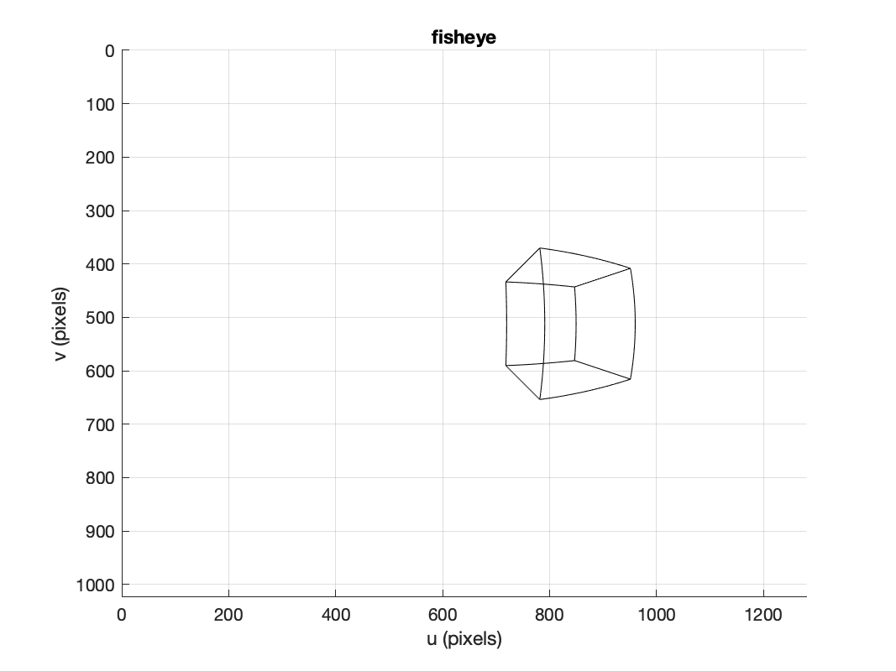

# Machine Vision Toolbox for Python

[](https://github.com/petercorke/robotics-toolbox-python)
[](https://qcr.github.io)

[](https://github.com/petercorke/spatialmath-python)
[](https://numpy.org)
[](https://opencv.org)
[](https://open3d.org)

[](https://badge.fury.io/py/machinevision-toolbox-python)
[](https://github.com/petercorke/machinevision-toolbox-python/actions/workflows/ci.yml)
[](https://codecov.io/gh/petercorke/machinevision-toolbox-python)

[](https://opensource.org/licenses/MIT)
[](https://pypistats.org/packages/machinevision-toolbox-python)

<!-- [](https://GitHub.com/petercorke/machinevision-toolbox-python/stargazers/) -->

<table style="border:0px">
<tr style="border:0px">
<td style="border:0px">
</td>
<td style="border:0px">

<li><a href="https://github.com/petercorke/machinevision-toolbox-python">GitHub repository </a></li>
<li><a href="https://petercorke.github.io/machinevision-toolbox-python/">Documentation</a></li>
<li><a href="https://github.com/petercorke/machinevision-toolbox-python/wiki">Wiki (examples and details)</a></li>
<li><a href="installation#">Installation</a></li>
<li><a href="https://github.com/petercorke/machinevision-toolbox-python/blob/main/CHANGELOG.md">Changelog</a></li>
<li><a href="https://petercorke.github.io/machinevision-toolbox-python/lite/">Web-based Jupyter notebook (zero install, experimental)</a></li>
</ul>
</td>
</tr>
</table>
<p style="font-size:80%">A modern Python toolbox for machine/computer vision.</p>

## Synopsis

The Machine Vision Toolbox for Python (MVTB-P) provides a consistent, Pythonic and powerful API for machine/computer vision.
It is built on mature and efficient foundations such as NumPy, SciPy, Matplotlib, OpenCV, and Open3D.
The main components are:

- An `Image` object with nearly 200 methods and properties that wrap functions
  from [NumPy](https://numpy.org), [OpenCV](https://opencv.org), [SciPy](https://scipy.org), and [Open3D](https://www.open3d.org). Methods support monadic, dyadic, filtering, edge detection,
  mathematical morphology and feature extraction (blobs, lines and point/corner features), as well as operator overloading. Images are stored as encapsulated [NumPy](https://numpy.org) arrays
  along with image metadata.
- An object-oriented wrapper of [Open3D](https://www.open3d.org) functions that supports a subset of operations, but allows operator overloading and is compatible with the [Spatial Math Toolbox](https://github.com/petercorke/spatialmath-python).
- A collection of camera projection classes for central (normal perspective), fisheye, catadioptric and spherical cameras.
- Some advanced algorithms such as:
  - multiview geometry: camera calibration, stereo vision, bundle adjustment
  - bag of words

Advantages of this Python Toolbox include:

- its use of mature, efficient and portable functions which provide a comprehensive and mature collection of functions for image processing and feature extraction;
- wrapping the OpenCV functions in a consistent way, hiding some of the gnarly details of OpenCV like conversion to/from float32 and the BGR color order.
- similarity to the <a href="https://github.com/petercorke/machinevision-toolbox-matlab">Machine Vision Toolbox for MATLAB<sup>&reg;</sup></a>

# Getting going

## Using pip

Install a snapshot from PyPI

```
% pip install machinevision-toolbox-python
```

## From GitHub

Install the current code base from GitHub and pip install a link to that cloned copy

```
% git clone https://github.com/petercorke/machinevision-toolbox-python.git
% cd machinevision-toolbox-python
% pip install -e .
```

# Examples

### Reading and display an image

```python
from machinevisiontoolbox import Image
mona = Image.Read("monalisa.png")
mona.disp()
```


Images can also be returned by iterators that operate over folders, zip files, local cameras, web cameras and video files.

### Simple image processing

The toolbox supports many operations on images such as 2D filtering, edge detection, mathematical morphology, colorspace conversion, padding, cropping, resizing, rotation and warping.

```python
mona.smooth(sigma=5).disp()
```


There are also many functions that operate on pairs of image. All the arithmetic operators are overloaded, and there are methods to combine images in more complex ways. Multiple images can be stacked horizontal, vertically or tiled in a 2D grid. For example, we could display the original and smoothed images side by side

```python
Image.Hstack([mona, mona.smooth(sigma=5)]).disp()
```

where `Hstack` is a class method that creates a new image by stacking the
images from its argument, an image sequence, horizontally.


### Binary blobs

A common problem in robotic vision is to extract features from the image, to describe the position, size, shape and orientation of objects in the scene. For simple binary scenes blob features are commonly used.

```python
im = Image.Read("shark2.png")   # read a binary image of two sharks
im.disp();   # display it with interactive viewing tool
blobs = im.blobs()  # find all the white blobs
print(blobs)

	┌───┬────────┬──────────────┬──────────┬───────┬───────┬─────────────┬────────┬────────┐
	│id │ parent │     centroid │     area │ touch │ perim │ circularity │ orient │ aspect │
	├───┼────────┼──────────────┼──────────┼───────┼───────┼─────────────┼────────┼────────┤
	│ 0 │     -1 │ 371.2, 355.2 │ 7.59e+03 │ False │ 557.6 │       0.341 │  82.9° │  0.976 │
	│ 1 │     -1 │ 171.2, 155.2 │ 7.59e+03 │ False │ 557.6 │       0.341 │  82.9° │  0.976 │
	└───┴────────┴──────────────┴──────────┴───────┴───────┴─────────────┴────────┴────────┘
```

where `blobs` is a list-like object and each element describes a blob in the scene. The element's attributes describe various parameters of the object, and methods can be used to overlay graphics such as bounding boxes and centroids

```python
blobs.plot_box(color="g", linewidth=2)  # put a green bounding box on each blob
blobs.plot_centroid(label=True)  # put a circle+cross on the centroid of each blob
plt.show(block=True)  # display the result
```


#### Binary blob hierarchy

A more complex image is

```python
im = Image.Read("multiblobs.png")
im.disp()
```


and we see that some blobs are contained within other blobs. The results in tabular form

```python
blobs  = im.blobs()
print(blobs)
	┌───┬────────┬───────────────┬──────────┬───────┬────────┬─────────────┬────────┬────────┐
	│id │ parent │      centroid │     area │ touch │  perim │ circularity │ orient │ aspect │
	├───┼────────┼───────────────┼──────────┼───────┼────────┼─────────────┼────────┼────────┤
	│ 0 │      1 │  898.8, 725.3 │ 1.65e+05 │ False │ 2220.0 │       0.467 │  86.7° │  0.754 │
	│ 1 │      2 │ 1025.0, 813.7 │ 1.06e+05 │ False │ 1387.9 │       0.769 │ -88.9° │  0.739 │
	│ 2 │     -1 │  938.1, 855.2 │ 1.72e+04 │ False │  490.7 │       1.001 │  88.7° │  0.862 │
	│ 3 │     -1 │  988.1, 697.2 │ 1.21e+04 │ False │  412.5 │       0.994 │ -87.8° │  0.809 │
	│ 4 │     -1 │  846.0, 511.7 │ 1.75e+04 │ False │  496.9 │       0.992 │ -90.0° │  0.778 │
	│ 5 │      6 │  291.7, 377.8 │  1.7e+05 │ False │ 1712.6 │       0.810 │ -85.3° │  0.767 │
	│ 6 │     -1 │  312.7, 472.1 │ 1.75e+04 │ False │  495.5 │       0.997 │ -89.9° │  0.777 │
	│ 7 │     -1 │  241.9, 245.0 │ 1.75e+04 │ False │  496.9 │       0.992 │ -90.0° │  0.777 │
	│ 8 │      9 │ 1228.0, 254.3 │ 8.14e+04 │ False │ 1215.2 │       0.771 │ -77.2° │  0.713 │
	│ 9 │     -1 │ 1225.2, 220.0 │ 1.75e+04 │ False │  496.9 │       0.992 │ -90.0° │  0.777 │
	└───┴────────┴───────────────┴──────────┴───────┴────────┴─────────────┴────────┴────────┘
```

We can display a label image, where the value of each pixel is the label of the blob that the pixel
belongs to, the `id` attribute

```python
labels = blobs.label_image()
labels.disp(colormap="viridis", ncolors=len(blobs), colorbar=dict(shrink=0.8, aspect=20*0.8))
```


We can also think of the blobs forming a hiearchy and that relationship is reflected in the `parent` and `children` attributes of the blobs.
We can also express it as a directed graph

```python
blobs.dotfile(show=True)
```


### Camera modelling

```python
from machinevisiontoolbox import CentralCamera
cam = CentralCamera(f=0.015, rho=10e-6, imagesize=[1280, 1024], pp=[640, 512], name="mycamera")
print(cam)
           Name: mycamera [CentralCamera]
     pixel size: 1e-05 x 1e-05
     image size: 1280 x 1024
           pose: t = 0, 0, 0; rpy/yxz = 0°, 0°, 0°
   principal pt: [     640      512]
   focal length: [   0.015    0.015]
```

and its intrinsic parameters are

```python
print(cam.K)
	[[1.50e+03 0.00e+00 6.40e+02]
	 [0.00e+00 1.50e+03 5.12e+02]
	 [0.00e+00 0.00e+00 1.00e+00]]
```

We can define an arbitrary point in the world

```python
P = [0.3, 0.4, 3.0]
```

and then project it into the camera

```python
p = cam.project(P)
print(p)
	[790. 712.]
```

which is the corresponding coordinate in pixels. If we shift the camera slightly the image plane coordinate will also change

```python
p = cam.project(P, T=SE3(0.1, 0, 0) )
print(p)
[740. 712.]
```

We can define an edge-based cube model and project it into the camera's image plane

```python
from spatialmath import SE3
X, Y, Z = mkcube(0.2, pose=SE3(0, 0, 1), edge=True)
cam.plot_wireframe(X, Y, Z)
```


<!---or with a fisheye camera

```matlab
>> cam = FishEyeCamera('name', 'fisheye', ...
'projection', 'equiangular', ...
'pixel', 10e-6, ...
'resolution', [1280 1024]);
>> [X,Y,Z] = mkcube(0.2, 'centre', [0.2, 0, 0.3], 'edge');
>> cam.mesh(X, Y, Z);
```



### Bundle adjustment
--->

### Color space

Plot the CIE chromaticity space

```python
plot_chromaticity_diagram("xy");
plot_spectral_locus("xy")
```


Load the spectrum of sunlight at the Earth's surface and compute the CIE xy chromaticity coordinates

```python
nm = 1e-9
lam = np.linspace(400, 701, 5) * nm # visible light
sun_at_ground = loadspectrum(lam, "solar")
xy = lambda2xy(lambda, sun_at_ground)
print(xy)
	[[0.33272798 0.3454013 ]]
print(colorname(xy, "xy"))
	khaki
```

### Hough transform

```python
im = Image.Read("church.png", mono=True)
edges = im.canny()
h = edges.Hough()
lines = h.lines_p(100, minlinelength=200, maxlinegap=5, seed=0)

im.disp(darken=True)
h.plot_lines(lines, "r--")
```


### SURF features

We load two images and compute a set of SURF features for each

```python
view1 = Image.Read("eiffel-1.png", mono=True)
view2 = Image.Read("eiffel-2.png", mono=True)
sf1 = view1.SIFT()
sf2 = view2.SIFT()
```

We can match features between images based purely on the similarity of the features, and display the correspondences found

```python
matches = sf1.match(sf2)
print(matches)
813 matches
matches[1:5].table()
┌──┬────────┬──────────┬─────────────────┬────────────────┐
│# │ inlier │ strength │              p1 │             p2 │
├──┼────────┼──────────┼─────────────────┼────────────────┤
│0 │        │     26.4 │ (1118.6, 178.8) │ (952.5, 418.0) │
│1 │        │     28.2 │ (820.6, 519.1)  │ (708.1, 701.6) │
│2 │        │     29.6 │ (801.1, 632.4)  │ (694.1, 800.3) │
│3 │        │     32.4 │ (746.0, 153.1)  │ (644.5, 392.2) │
└──┴────────┴──────────┴─────────────────┴────────────────┘
```

where we have displayed the feature coordinates for four correspondences.

We can also display the correspondences graphically

```python
matches.subset(100).plot("w")
```

in this case, a subset of 100/813 of the correspondences.


Clearly there are some bad matches here, but we we can use RANSAC and the epipolar constraint implied by the fundamental matrix to estimate the fundamental matrix and classify correspondences as inliers or outliers

```python
F, resid = matches.estimate(CentralCamera.points2F, method="ransac", confidence=0.99, seed=0)
print(F)
array([[1.033e-08, -3.799e-06, 0.002678],
       [3.668e-06, 1.217e-07, -0.004033],
       [-0.00319, 0.003436,        1]])
print(resid)
0.0405

Image.Hstack((view1, view2)).disp()
matches.inliers.subset(100).plot("g", ax=plt.gca())
matches.outliers.subset(100).plot("r", ax=plt.gca())
```

where green lines show correct correspondences (inliers) and red lines show bad correspondences (outliers)


# History

This package can be considered as a Python version of the [Machine Vision
Toolbox for MATLAB](). That Toolbox, now quite old, is a collection of MATLAB
functions and classes that supported the first two editions of the Robotics,
Vision & Control book. It is a somewhat eclectic collection reflecting my
personal interest in areas of photometry, photogrammetry, colorimetry. It
includes over 100 functions spanning operations such as image file reading and
writing, acquisition, display, filtering, blob, point and line feature
extraction, mathematical morphology, homographies, visual Jacobians, camera
calibration and color space conversion.

This Python version differs in using an object to encapsulate the pixel data and
image metadata, rather than just a native object holding pixel data. The many
functions become methods of the image object which reduces namespace pollutions,
and allows the easy expression of sequential operations using "dot chaining".

The first version was created by Dorian Tsai during 2020, and based on the
MATLAB version.  That work was funded by an Australian University Teacher of
the year award (2017) to Peter Corke.
