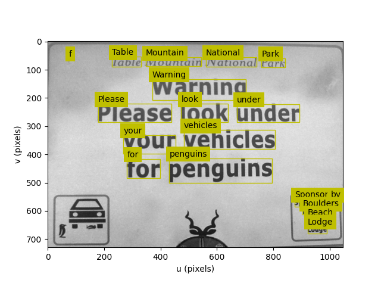

Command line tools
==================

The Toolbox ships with a number of command-line tools that provide convenient access to some of the functionality of the toolbox without needing to write a script.

All tools accept image file names as command-line arguments.  These can be:

* the name of a local file.  If the file is not found locally, it is searched for in the accompanying
  image data folder, for example ``street.png``
* a URL, for example ``https://petercorke.com/files/images/monalisa.png``

MVTB tool
---------

An interactive IPython session with the
MVTB toolbox, NumPy and Matplotlib already imported. Compared to the regular Python REPL
it has the advantage of command
history, tab completion, and inline help.  For example::

	$ mvtbtool
	_  _ ____ ____ _  _ _ _  _ ____    _  _ _ ____ _ ____ _  _ 
	|\/| |__| |    |__| | |\ | |___    |  | | [__  | |  | |\ | 
	|  | |  | |___ |  | | | \| |___     \/  | ___] | |__| | \| 
															
	___ ____ ____ _    ___  ____ _  _                          
	|  |  | |  | |    |__] |  |  \/                           
	|  |__| |__| |___ |__] |__| _/\_  

	for Python

	You're running: MVTB==0.9.7, SMTB==1.1.13, NumPy==1.26.4, SciPy==1.14.1,
					Matplotlib==3.10.0, OpenCV==4.10.0, Open3D==0.18.0
	 .
	 .
	 .
	>>> im = Image.Read("monalisa.png")
	>>> im.disp()
	Out[2]: <matplotlib.image.AxesImage at 0x1690e9720>

Images can also be loaded by listing them as command-line arguments, either as a filename or a URL::

	$ mvtbtool street.png 

and the images appear in the IPython session as ``img`` which is an instance, or a list
of instances, of :class:`~machinevisiontoolbox.ImageCore.Image` objects, in the order
they are listed on the command line. For example:: 

	$ mvtbtool street.png https://petercorke.com/files/images/monalisa.png

A script can be run at startup using the ``--run`` option. For example:

.. code-block:: python
   :caption: myscript.py

   img.disp()

then we can run the script at startup with an image file by::

	$ mvtbtool street.png --run=myscript.py

and the result is a display of the image in an interactive Matplotlib window and the
IPython session is left open for further experimentation.

`IPython <https://ipython.readthedocs.io/en/stable/index.html>`_ has many configuration options and mechanisms including command-line arguments,
configuration files and startup scripts. ``mvtbtool``'s command-line arguments are processed before IPython's command-line options.

.. command-output:: mvtbtool --help

Image tool
----------

``imtool`` is a command-line tool that opens a window for each of the images specified
on the command line.  For example::

	$ imtool street.png https://petercorke.com/files/images/monalisa.png

Essentially, it is just another image browser, but images are displayed using ``idisp``
which has a number of useful features such as the ability to zoom, pan and scroll the
image, as well as display the coordinate and pixel value at the cursor position.

Left-click and drag the mouse to define a rectangular region of interest (ROI).  After releasing the mouse button, the rectangle displays drag handles in the centre of each edge which allows for resizing the rectangle.  
Various key presses perform operations on the rectangle:

* 'p' key will pop the rectangle out as a new window.  
* 'h' key will display a pixel frequency histogram.
* 'c' key will display a cumulative pixel frequency histogram.
* '?' will display help text.

Shift-left-click and drag will draw a line.  After releasing the mouse button, a plot of pixel intensity values along the line will be displayed. 

The pixel values are, by default, displayed in the color space of the image, but the
``--colorspace`` option can be used to specify a different color space for display.  For
example::

	$ imtool street.png --colorspace=Lab

will display the image in its original color space, but the pixel values under the
cursor will be displayed in the Lab color space.

The pick option allows the user to click on the image and select a series of coordinates. For example::

	$ imtool street.png --points

Each selected point is indicated by a red cross and the coordinates of the point are
printed to the terminal.  Left-click adds a new point, right-click removes the last
added point, and Enter means end of picking and the coordinates of the selected points
are printed to the terminal.  The coordinates are in pixel units, with the origin at the
top left corner of the image:: 

	$ imtool street.png --points
	   u       v       Δu      Δv      |Δ|   
	146.6   91.1                            
	302.7   136.2   156.1    45.2    162.5  
	301.4   645.9   -1.3     509.7   509.7  
	142.7   682.0   -158.7   36.1    162.8

You can zoom in using the magnifier button at bottom of the window to achieve more accurate picking.

.. warning:: It is important to select the window (click the title bar) before clicking on the image,
	otherwise the first click will just select the window and not be.  

.. command-output:: imtool --help

Tag tool
---------

``tagtool`` is a command-line tool that highlights the AR markers (ArUco or AprilTag) in
the specified image.  For example::

	$ tagtool lab-scene.png
	tag IDs: 0, 1, 2, 3, 4, 5

The tool prints the tag IDs to the terminal, and displays the image with the tags highlighted.

If we know the camera intrinsics we can also estimate the pose of the tags and display the coordinate frames of the tags in the image.  For example::

	$ tagtool -f=3045 -p=2016,1512 -s=0.067 --axes lab-scene.png --camera=lab-camera.json

where the tag side length is 67mm, the camera focal length is 3045 pixels, and the principal point is at (2016, 1512)
pixels. If the focal length is known in metres, then the --rho option must be used to specify the pixel pitch in metres per pixel, for example::

	$ tagtool -f=0.004 -p=2016,1512 --rho=0.000001 -s=0.067 --axes lab-scene.png

So long as you are consistent about units you can have focal length in mm and pixel pitch in mm/pixel.

.. image:: https://github.com/petercorke/machinevision-toolbox-python/raw/main/docs/figs/tagtool.png
	:alt: Binary image showing bounding boxes and centroids

.. command-output:: tagtool --help

OCR tool
--------

``ocrtool`` is a command-line tool that performs optical character recognition (OCR) on the specified image.  For example:

.. command-output::	ocrtool penguins.png -l

The tool uses Tesseract OCR to identify words in the image and their bounding boxes.  The results are printed to the terminal as a table of word, confidence, left, top, right, bottom, width and height.  The bounding box is shown in the image if the ``--view`` option is specified.  For example::

	$ ocrtool penguins.png --view

.. command-output:: ocrtool --help

ROS bag tool
------------

``bagtool`` is a command-line tool that reads images and point clouds from a ROS bag file and displays
them. To scope out what's in the bag file, the tool can print a table of the topics in
the bag file, the message type of each topic, the number of messages on each topic, and
whether the topic is allowed (according to the message and topic filters applied, see ``--message`` and ``--topic``) to be displayed. For example::

	$ wget https://download.ifi.uzh.ch/rpg/drone_racing_data/race_1.bag # download from UZH FPV Racing Dataset (570MB)
	$ bagtool race_1.bag
	ROSBag('bags/race_1.bag')
	recorded on 2022-06-07T05:34:11.367+10:00, duration 00:00:28, 12213 messages
	┌────────────────────────────┬───────────────────────┬───────┐
	│           topic            │        msgtype        │ count │
	├────────────────────────────┼───────────────────────┼───────┤
	│ /camera/fisheye2/image_raw │ sensor_msgs/msg/Image │   855 │
	│ /camera/odom/sample        │ nav_msgs/msg/Odometry │  5679 │
	│ /camera/imu                │ sensor_msgs/msg/Imu   │  5679 │
	└────────────────────────────┴───────────────────────┴───────┘

We can see that the bag contains many images (messages type ``sensor_msgs/msg/Image``), and we can display them as an animation::

	$ bagtool -m Image --animate race_1.bag

where the message filter ``-m Image`` is used to specify the messages that contain ``Image``.
A filter is simply a substring that must be present in the message type for the topic to be allowed.  

Various keystrokes can be used to pause/resume the animation, and change the playback speed.  Note that in this particular bag file the rotors don't 
start spinning until around frame 60, and takeoff is at around frame 270. If we omit ``-m Image`` then the tool will 
fail when it encounters a non-image message.

Alternatively, the tool can display 
one frame at a time, with keystrokes to jump forward in various step sizes::

	$ bagtool -m Image --view race_1.bag

The image is displayed using :meth:`disp` and has the ability to zoom and pan the image as well as display pixel values under the cursor.  The current
topic is displayed in the title bar of the window.

Left-click and drag the mouse to define a rectangular region of interest (ROI).  After releasing the mouse button, the rectangle displays drag handles in the centre of each edge which allows for resizing the rectangle.  
Various key presses perform operations on the rectangle:

* 'p' key will pop the rectangle out as a new window.  
* 'h' key will display a pixel frequency histogram.
* 'c' key will display a cumulative pixel frequency histogram.
* '?' will display help text.

Shift-left-click and drag will draw a line.  After releasing the mouse button, a plot of pixel intensity values along the line will be displayed. 

If multiple topics contain images, select the one to display using the ``--topic`` option which specifies a substring that must be present in the topic name::

	$ bagtool -m Image  --view --topic=fisheye2 race_1.bag

The tool goes to some effort to convert the ROS ``sensor_msgs/msg/Image`` message into the correct pixel data type and
color order.  NaNs within floating point images are displayed as red.

Point clouds (uncolored and colored) can also be displayed or animated.  For example, using the CSIRO forest dataset:

.. code-block:: bash

	$ bagtool --message PointCloud2 --animate forestI.bag

.. note:: If a bag file is given as a URL it will be downloaded and cached locally in a temporary file. If the ``--keep`` option is given it will be saved in the current directory. 

Some sources of ROS bag files include:

	* `UZH FPV Racing Dataset <https://fpv.ifi.uzh.ch/datasets/>`_
	* `Freiburg RGB-D Dataset <https://cvg.cit.tum.de/data/datasets/rgbd-dataset/download>`_
	* `Kitti dataset <https://www.cvlibs.net/datasets/kitti/>`_
	* `CSIRO Forest Dataset <https://data.csiro.au/collection/58063>`_, then Files/forestI/forestI.bag

.. command-output:: bagtool --help

