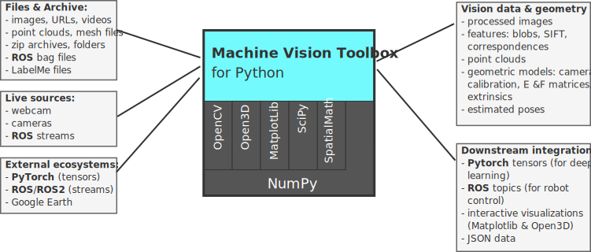
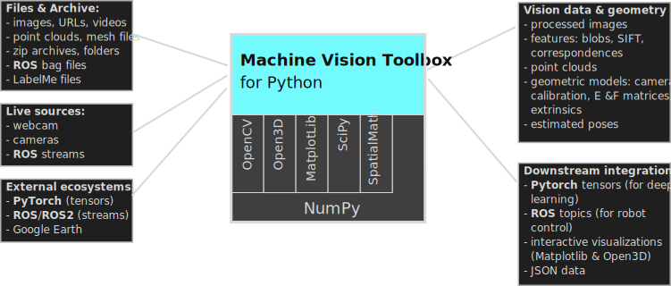

.. Machine Vision Toolbox documentation master file, created by
   sphinx-quickstart on Sun Jul 19 11:06:16 2020.
   You can adapt this file completely to your liking, but it should at least
   contain the root `toctree` directive.

:html_theme.sidebar_secondary.remove:

.. Machine Vision Toolbox for Python documentation master file

.. grid:: 1 2 2 2
    :gutter: 0
    :class-container: mvt-hero-grid

    .. grid-item::
        :columns: 12 4 4 4
        :class: mvt-hero-logo-col

        .. image:: ../figs/VisionToolboxLogo_NoBackgnd@2x.png
            :width: 180px
            :align: center
            :class: main-logo

    .. grid-item::
        :columns: 12 8 8 8
        :class: mvt-hero-text-col

        .. container:: mvt-hero-title

            **Machine Vision Toolbox for Python**

        .. container:: mvt-tagline-hero

            Object-oriented vision for Python. A unified framework for **spatial reasoning** and **computer vision**
            harmonizing NumPy, OpenCV, and Open3D.

.. grid:: 1 2 2 2
   :gutter: 3
   :class-container: main-dashboard

   .. grid-item-card:: :octicon:`rocket;1em` Getting Started
        :link: card-intro
        :link-type: doc

        Explore the **rationale**, see code **examples**, and get the toolbox **installed** in your local environment

   .. grid-item-card:: :octicon:`beaker;1em` Vision Algorithms
        :link: card-algorithms
        :link-type: doc

        Access over 100 specialized functions for image filtering, feature extraction (blobs, points, lines), mathematical morphology, stereo vision, bundle adjustment, camera calibration and more.

   .. grid-item-card:: :octicon:`book;1em` Core Objects
        :link: card-code
        :link-type: doc

        The object-oriented heart of the toolbox. High-level wrappers for **Image**, **PointCloud**, and **Camera** classes, built on a robust computational **base**.

   .. grid-item-card:: :octicon:`terminal;1em` Interactive Lab
        :link: jupyter-notebooks
        :link-type: doc

        Learn by doing with our **JupyterLite** environment. Run examples instantly in your browser or explore our library of **Google Colab** templates.

   .. grid-item-card:: :octicon:`hubot;1em` Integrations
        :link: card-integration
        :link-type: doc

        Bridge the gap to the wider robotics ecosystem with native support for **ROS 2** message streams and **PyTorch** tensor interfaces.

.. raw:: html

   

      
   

.. card:: Features at a Glance
   :shadow: none
   :class-card: sd-bg-light

   * **Pythonic OpenCV Wrapper:** Images are first-class objects with intuitive operators and transparent BGR/float32 handling.
   * **100+ Vision Tools:** From image acquisition and morphology to blob, point, and line feature extraction.
   * **Geometric Intelligence:** Purpose-built for vision-based control, including visual Jacobians, homographies, and camera calibration.
   * **Efficient Core:** Inherits the performance and maturity of the NumPy and OpenCV ecosystems.

.. rst-class:: docs-heading-small

Documentation 
^^^^^^^^^^^^^^^^^

.. toctree::
   :maxdepth: 2
   :hidden:

   card-intro
   card-algorithms
   card-code
   jupyter-notebooks
   card-integration

* :ref:`genindex`
* :ref:`modindex`